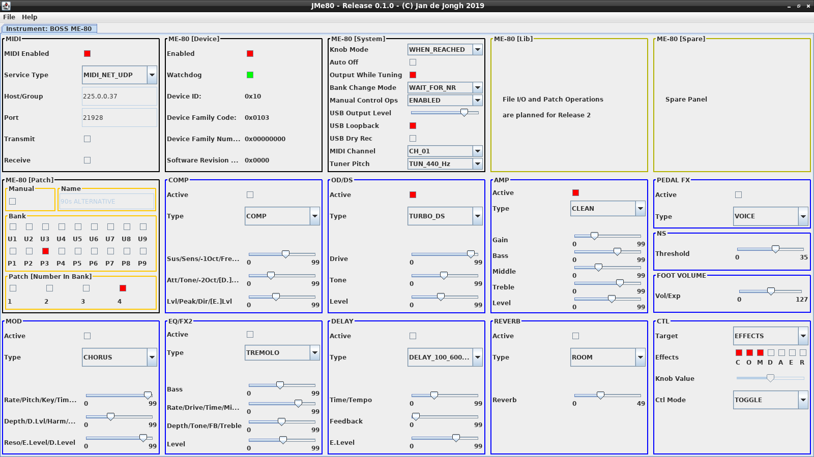

# jmididevice
A Java library holding a few MIDI device (incl. Boss ME-80) implementations, some with Swing components.

## Introduction

The jservice library introduces (among others) the Service, MidiService, and MidiDevice interfaces.
The present library, jmididevice, features implementations of MidiDevice for devices I own.
In addition, it features Java Swing components for monitoring and/or controlling (or even playing)
these devices.

Currently (v0.1.0), it the library features a single implementation for the Boss ME-80.
However, work on the Alesis Quadraverb (GT) and some AKAI MIDI controllers is underway.

The remainder of this README describes the Boss ME-80 Patch Editor (the library's Main class at the present time).

## Boss ME-80 Patch Editor

### Screenshot

